# Anémomètre
1. # Anémomètre

   1. ## Présentation du système

L’anémomètre est un capteur qui permet de mesurer la vitesse et la direction du vent. Ce capteur permet au pilote automatique de s’adapter en fonction des conditions quand il est connecté à l’IHM.

Cet anémomètre est une amélioration du projet suivant :  
[https://open-boat-projects.org/en/windsensor-yachta/](https://open-boat-projects.org/en/windsensor-yachta/)

Pour obtenir la direction du vent, l’anémomètre utilise un aimant et un capteur magnétique qui lui permet d’avoir la direction du champ magnétique de l’aimant.

*Figure 6 :  anémomètre fonctionnel* 

Pour obtenir la vitesse du vent, l’anémomètre utilise 4 aimants où on alterne successivement la direction du champ magnétique. Le capteur utilisé est un capteur à effet hole qui permet de mesurer ces changements de sens du champ magnétique. La fréquence obtenue permet alors de mesurer la vitesse de rotation des coupelles qui est proportionnelle à celle du vent.

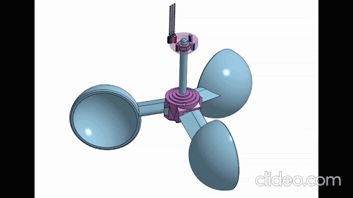

*Figure 7 : coupelles de l’anémomètre*

2. ## Fabrication de la carte électronique

Todo

3. ## Installation du firmware

   4. ## Montage mécanique

Pour monter l’entièreté du système, vous aurez besoin uniquement des outils suivants :

* Imprimante 3D  
* Jeu de clés Allen  
* Fer à souder  
* Ordinateur avec un câble USB-C

Pour l’impression 3D :  
Le design a été fait sur Onshape, un site web permettant de faire de la modélisation 3D gratuitement.  
Le lien suivant vous permet d’accéder à la modélisation 3D de l’anémomètre et de copier l’espace de travail pour adapter les parties :  
[https://centralelille.onshape.com/documents/f9b90260c58491739822fbe3/w/62acd9df5da8c8ddfe89f5b6/e/0e559c2feb2e8f1b7c776362?renderMode=0\&uiState=693ebf92a69bb09714a9be19](https://centralelille.onshape.com/documents/f9b90260c58491739822fbe3/w/62acd9df5da8c8ddfe89f5b6/e/0e559c2feb2e8f1b7c776362?renderMode=0&uiState=693ebf92a69bb09714a9be19)

En bas de l’interface, vous trouverez tous dossiers qui ont permis de créer l’anémomètre :

* Global assembly : permet de voir l’assemblage global du système ainsi que les mouvements des pièces les unes par rapport aux autres  
* comparaison\_windsensor : dossier dans lequel vous pourrez retrouver d’autres anémomètres  
* Settings : tableau des paramètres qui permettent de modifier rapidement certaines parties du modèle  
* parts adapted 3D printing : dossier dans lequel vous retrouverez toutes les parties de l’anémomètre avec un ajout de jeu testé sur une imprimante 3D.  
* clearance\_test : dossier dans lequel vous trouverez des gabarits permettant de tester le jeu des pièces les unes par rapport aux autres  
* Standard parts : dossier avec toutes les pièces qui ne sont pas imprimées mais nécessaires pour l’anémomètre (ex : aimants, roulements à billes…)  
* Sub\_parts : dossier dans lequel vous trouverez la modélisation de chaque pièce sans jeux  
* Documentation : dossier regroupant certaines datasheets des pièces utilisées  
* Import CAO : dossier contenant les fichiers .step des éléments importés dans cet espace de travail

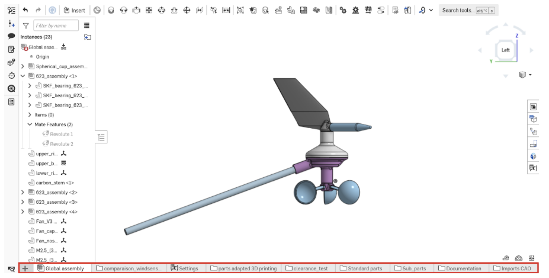

*Figure 8  : dossiers avec les éléments importés*

Quelques conseils avant d’imprimer les pièces :

* Imprimez les pièces en **ABS** du fait de sa meilleure résistance à la chaleur.  
* Les jeux utilisés dans le dossier parts adapted 3D printing ont été fait pour une imprimante PRUSA MK3 avec une buse de 0.4mm. Les jeux ne correspondront très probablement pas avec votre imprimante. Je vous conseille d’imprimer les pièces dans clearance\_test pour tester les jeux sur les différentes pièces du système.Dans le dossier, voici les différents tests :  
  *   
  * ball\_bearing\_test : test pour insérer les roulements à billes  
  * fan\_nose\_test : test pour l’insertion du bout de la girouette (à tester sur la pièce nommée **fan**)  
  * fan\_cap\_test : test pour le capuchon de protection de l’écrou dans la girouette (à tester sur la pièce nommée **fan**)  
  * cup\_holder\_test : test pour l’insertion des coupelles (à tester sur la pièce nommée **cup\_holder**)  
  * nose\_balance : à imprimer uniquement si la girouette est n’est pas équilibrée

Pour mesurer des diamètres, distances… appuyez sur le mètre en bas à droite de l’écran :

*Figure 9 :  outil de mesure des distances*

Cliquez sur le ou les faces/arêtes nécessaires pour la mesure :

*Figure 10 outil de mesure des distances*

pour exporter les pièces pour les imprimer en 3D, affichez uniquement les pièces que vous voulez imprimer en cliquant sur l’oeil :

*Figure 11 :  export des pièces à imprimer*

Faites ensuite **clic droit \-\> Export…** sur le fichier (dans la barre en bas) ou si vous voulez uniquement exporter une pièce, faites le sur la part dans l’onglet parts (cf au dessus)  
Vous aurez alors une page de paramètre qui va apparaître, faites attention à bien exporter en .**slt** et d’avoir l’unité millimètre :

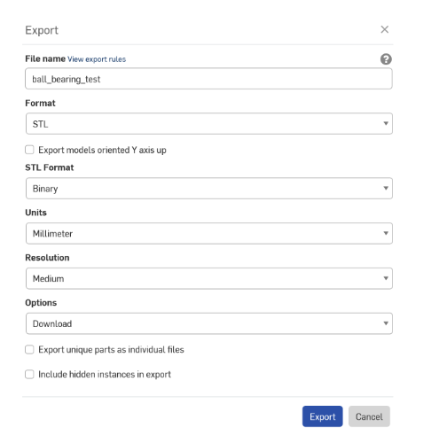

*Figure 12 : export des pièces à imprimer*

Quand vous connaissez les jeux adaptés à votre imprimante 3D, allez dans le dossier parts adapted 3D printing \-\> final version et dans les différents part studio vous trouverez les fonctions “**move face**” : 

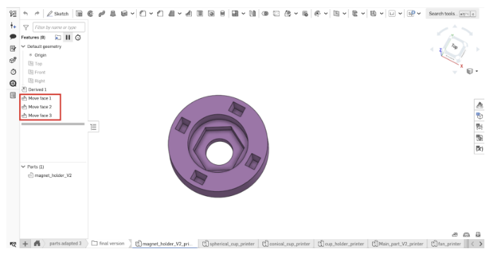

*Figure 13 :  fonctions move face*

Faites un **double-clic** pour modifier la fonction et ajustez le jeu en modifiant la valeur dans “**distance**”

*Figure 14 :  ajustement du jeu*

Choix de la coupelle : J’ai modélisé 4 formes de coupelles différentes. Toutes les formes sont viables mais les coupelles plus courtes tourneront plus vite. Si vous voulez comparer leurs performances, allez regarder l’excel des tests en soufflerie.

Impression des pièces :  
Voici la liste des pièces que vous devez imprimer en 3D :

* x1 magnet\_holder (V2)  
* x1 cup holder  
* x1 lower body  
* x1 upper body  
* x1 lower ring  
* x1 upper ring (attention les 2 pièces sont différentes, un symbole permet de les différencier, cf main\_part\_V2\_printer)  
* x3 cup (choisissez l’une des 4 formes de coupelles)  
* x1 fan (V3)  
* x1 fan\_nose (V3) (optionnel, nose balance si la girouette n’est pas bien équilibrée, à modifier manuellement)  
* x1 fan\_cap

Dans la modélisation, j’ai essayé de rendre les pièces imprimables avec le moins de support possible. Voici l’orientation de chaque pièces avec les endroits où j’ai mis du support :

* Les pièces imprimables sans support :   
  * magnet\_holder  
  * cup holder  
  * lower ring  
  * upper ring  
  * fan\_cap  
  * fan\_nose (ATTENTION, imprimez cette pièce avec un remplissage de **100%**)

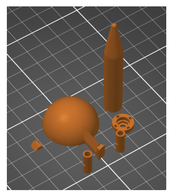

  *Figure 15 :  impression des pièces*

  

* Les pièces nécessitant du support :  
  * cup holder : je conseille de mettre du support sur ces faces en mettant un support organique pour éviter au maximum que le support s'appuie sur le bas de la glissière

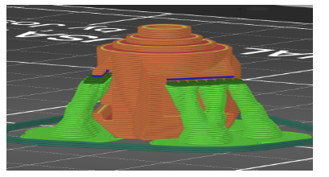

  *Figure 16 : cup holder*

    

  * fan : les tests d’équilibrage on était fait en imprimant cette pièce avec un remplissage de 15%, 2 couches de parois verticales et 4 horizontales avec une précision d’impression de 0.2mm. D’autres paramètres changeront légèrement la répartition du poids de la girouette et donc son équilibrage. (Il est possible d’imprimer la pièce nose balance ou changer la taille de la pièce fan\_nose pour rééquilibrer la girouette, expliqué dans la suite)

  *Figure 17 :  fan vue de dessous*

  *Figure 18 :  fan vue de côté*

  

  *Figure 19 :  fan vue slicer imprimante 3D*

  

  * lower body : 

    
                    
   * Figure 20 :  lower body vue de dessous                                  Figure 21 :  lower body vue de côté *          

*Figure 22 :  lower body vue slicer imprimante 3D*

* upper body :

   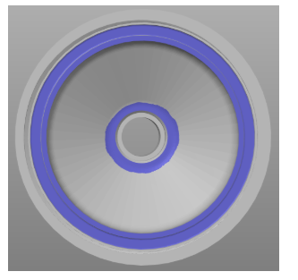
  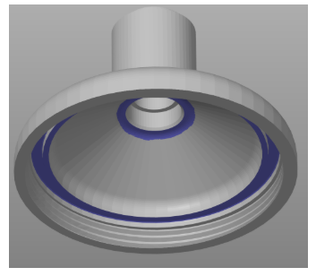
                                     
*Figure 23 :  upper body vue de dessous                                         Figure 24 : upper body vue de côté*

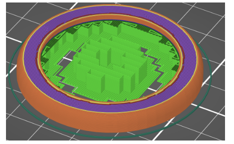

*Figure 25 :  upper body vue slicer imprimante 3D*

Montage :

* Insérez les roulements à billes dans les parties hautes et basses en n’oubliant pas de mettre les entretoises entre à chaque fois :  
                                    

*Figure 26 :  roulements à billes vue de dessus             Figure 27 :  roulements à billes vue de dessous*

* Assemblez le magnet holder : ATTENTION, il faut alterner sens des magnets.  Pour se faire, insérez un magnet dans l’un des trous, ensuite prenez un autre magnet et rapprochez le de celui insérez, s’ils s’attirent, cela veut dire que les faces sud de l’un et nord de l’autre se font face. Dans ce cas, placez le magnet dans l’un des trous adjacent au magnet placé en faisant attention à bien mettre la face attirée vers l’extérieure pour alterner les face nord et sud à chaque fois (cf images en dessous)
*   
  
                                            
  *Figure 28 :  assemblage des aimants                                       Figure 29 : schéma des aimants*

    
* Assemblez le magnet holder avec la partie basse :
  
  
  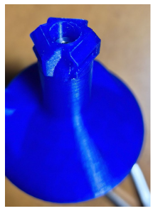
                                             
  *Figure 30 :  assemblage des 2 parties                           Figure 31 :  assemblage des 2 parties*  
    
    
* Insérez les coupelles sur la partie rotative : je vous conseille de mettre un point de superglue, car les coupelles ont tendance à glisser avec l’usure.  

    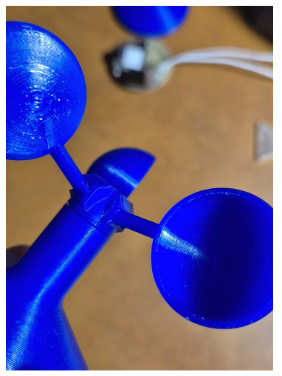
  
  *Figure 32 :  assemblage des coupelles*

    
* Attention à ne pas trop serrer la partie rotative, même si les roulements sont maintenus avec les entretoises, cela à tendance à rendre le frottement très important. Si vous arrivez à faire comme sur le gif juste en dessous avec votre anémomètre, alors vous avez correctement serré cette partie. Si vous avez peur que l’écrou se dévisse au cours du temps, n’hésitez pas à mettre un peu de frein filé après montage :

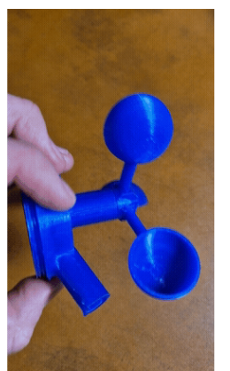

*Figure 33 :  montage des coupelles*

* Collez l’aimant cubique sur la vis : ATTENTION, vérifiez bien que les faces nord et sud de l’aimant se situent sont sont positionnés comme sur l’image ci-dessous (vous pouvez utiliser une pièce de 5 centimes pour savoir quelles faces du cube sont aimantées)  
                       

  *Figure 34 :  aimant et vis réalité                                        Figure 35 :  face de l’aimant* 

* Insérez l’écrou dans la girouette :
* 
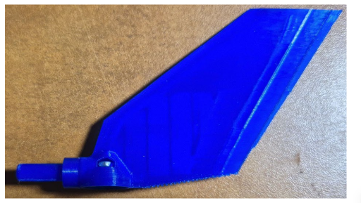

  *Figure 36 :  girouette*  
    
    
* Mettez le nez de la girouette et le capuchon de l’écrou :  

    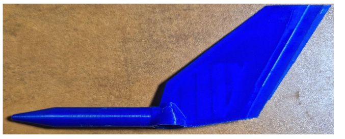
  
  *Figure 37 :  girouette montée*

    
* Montez la girouette sur la partie haute et vérifiez que la girouette est correctement équilibrée en la mettant horizontalement et vérifiant qu’elle ne tourne pas et faites le même test que pour les coupelles pour vérifier le serrage :  

  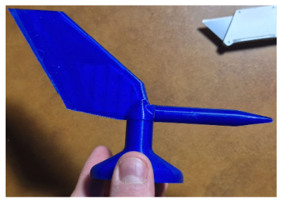
  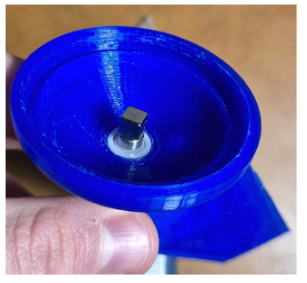

         *Figure 38 :  montage de la girouette vue de côté                 Figure 39 :  montage vue de dessus* 

* Insérez la carte électronique comme sur les photos et mettez la tige de carbone (coupez-la à la longueur que vous voulez, 25cm est une bonne taille). Vous pouvez fixer la carte électronique avec 2 vis M3 de 6mm.  

  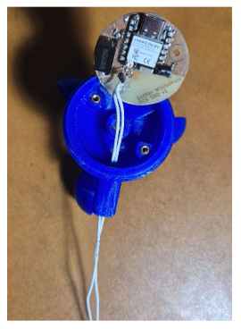
                             
  *Figure 40 : insertion de la carte électronique                   Figure 41 : montage vue de dessus*

    
* Finissez de monter l’anémomètre en vissant la partie basse et haute :  

    
  
  *Figure 42 : montage final*

  5. ## Configuration logicielle

Une fois alimenté, un réseau wifi intitulé “Yachta” devrait apparaitre, le mot de passe est “12345678”. En s’y connectant, et en allant sur la page web [http://192.168.5.1/](http://192.168.5.1/), vous pouvez accéder à l’interface web.  
Pour voir les valeurs des capteurs, cliquer sur l’onglet “Wind Instrument” ou “Wind Values”.  
Pour configurer l’anémomètre (coefficients de calibration, connecter au réseau wifi du bateau, et plus encore), cliquer sur “Device settings”. Une fois les modifications des paramètres effectués, sauvegarder en cliquant sur “Save”, puis redémarrer l’anémomètre en  le débranchant ou en cliquant sur “Restart Device” sur le menu principal.

Si vous souhaitez connecter l’anémomètre à une interface Homme Machine, vous pouvez le connecter à son réseau wifi en configurant “WLAN Client SSID” et “WLAN Client Password”.
