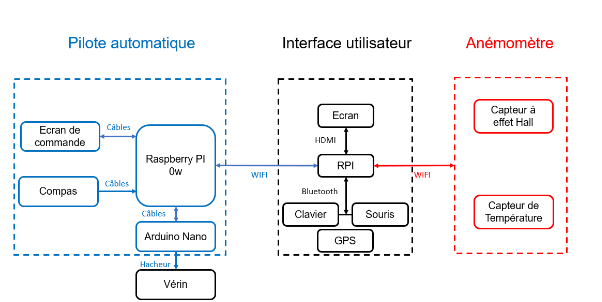
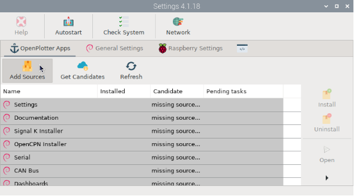
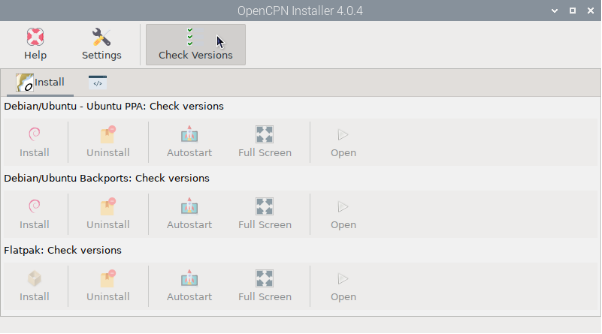
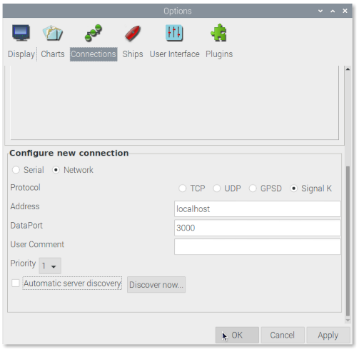

# Interface de contrôle

## Présentation du système

L’interface de contrôle, ou Interface Homme-Machine (IHM) constitue le point central d’interaction entre l’utilisateur et le système de navigation. Elle permet de visualiser en temps réel la position du bateau, le cap, ainsi que les données issues de l’anémomètre et du pilote automatique.


/// figure-caption
Rôle de l’IHM dans le système
///

D’un point de vue logiciel, l’IHM repose sur [Signal K](https://signalk.org/), qui assure la centralisation et la distribution des données entre les différents sous-systèmes. [OpenCPN](https://www.opencpn.org/) agit comme interface graphique principale pour la navigation et le pilotage.

Pour la partie matérielle, tout ordinateur compatible avec OpenPlotter peut être utilisé. Néanmoins, l’ensemble du système a été développé et validé sur Raspberry Pi 4, configuration que nous recommandons. Un écran, un clavier et une souris sont nécessaires pour la configuration initiale.

##  Montage 

### Installation d’OpenPlotter

L’installation d’OpenPlotter nécessite un second ordinateur afin de préparer la carte SD.  
Télécharger l’image officielle d’OpenPlotter depuis le site officiel, puis utiliser un logiciel de flashage tel que [Balena Etcher](https://etcher.balena.io/).  
Insérer la carte SD dans le Raspberry Pi, connecter les périphériques (écran, clavier, souris), puis démarrer le système. Lors du premier lancement, configurer la langue, le clavier et la connexion internet. Une connexion internet est indispensable pour la suite de l’installation.

### Installation et mise à jour des applications

Allez dans le panneau en haut à droite.  
À moins d’être précisé autrement, l’installation des applications sera faite via l’application `Settings` (accessible depuis le bouton en haut à gauche). Dans `Settings`, cliquer sur `Add sources` puis sur `add candidates`. Si vous avez besoin à un moment ultérieur de mettre à jour une application, re-cliquez sur `add candidates` pour avoir les mises à jour.


/// figure-caption
Applications disponibles dans OpenPlotter
///

### Installation de Signal K

Dans `settings`, installez *Signal K installer* :  
Une fois cet *installer* installé, vous pouvez vous connecter au serveur de Signal K en vous connectant ainsi :   
Ouvrir Chromium (ou Firefox) et tapez [https://localhost:3000](https://localhost:3000) dans la barre d’adresse.  
Vous pouvez aussi utiliser [ceci](https://github.com/SedNavOrg/SedNavOrg.github.io/blob/main/ihm/ouverture_site.sh), qui le fait pour vous.

Une fois connecté, vous avez une demande pour créer un compte administrateur, Notez les bien quelque part \!

### Installation d’OpenCPN

Comme précédemment, installez OpenCPN via settings:  
Sur l’installer, cliquez sur `check versions`, puis dans `install`, sélectionnez la version *Backport* (c’est celle la plus à jour)


/// figure-caption
Installateur d’OpenCPN
///

Une fois OpenCPN installé, il faut connecter OpenCPN au serveur Signal K : allez dans `Options` puis dans `Connection` et dans la section **“configure a new connection”**, sélectionnez network.  
Comme protocole, choisissez Signal k, comme adresse **Localhost** et comme port **3000**. Laissez l’option automatic server discovery décochée (voir figure ci-dessous).


/// figure-caption
Connexion entre OpenCPN et Signal K
///

Vous pouvez de plus commencer à préparer la connexion au pilote automatique en installant le plugin pypilot.

### Mise en place du Hotspot

Vous avez à votre disposition 2 solutions : 

=== "Installateur automatique (script)"
    Pour installer le hotspot, le point d'accès wifi, vous pouvez utiliser cet [installateur](https://github.com/SedNavOrg/SedNavOrg.github.io/blob/main/ihm/setuphotspot.sh) :
    ```console title="setuphotspot.sh"
    --8<-- "ihm/setuphotspot.sh"
    ```

=== "Mise en place manuelle"
    1. Dans le panneau de configuration du Wifi, en haut à droite :   
      Dans `Advanced Options` \> `Create Wireless Hotspot` \> `Create New Wi-Fi Hotspot` (photo)  
      Créer le réseau Wifi :   
    2. Choisir le nom, le mot de passe (wifi security)  
    3. Dans `Advanced Options` \> `Edit Connections`  
    4. Sélectionner le réseau créé (photo)

    5. Sélectionner :   
      * Band: B/G (2.4 GHz)  
      * Channel: 6 (2437 MHz)

Arrivé ici, nous vous invitons à installer le reste des systèmes et à revenir ici une fois cela fait.
