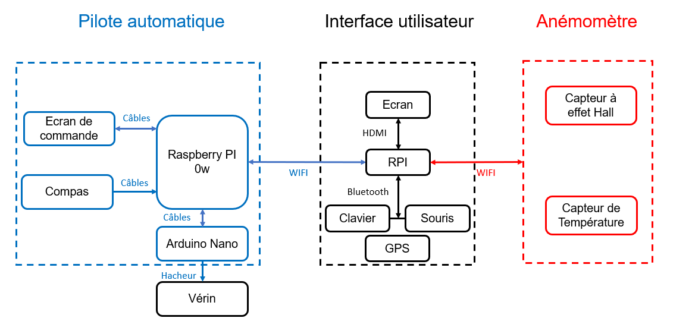

# Présentation du système complet

Voici ce que vous obtiendrez après le montage des différents éléments : 

/// figure-caption
Architecture matérielle du système
///

La figure 1 détaille l’ensemble des éléments et le moyen de communication entre les différentes sous-parties (IHM, pilote automatique et capteurs).

Dans cette documentation, nous allons détailler par la suite comment mettre en relation les différents éléments du schéma.